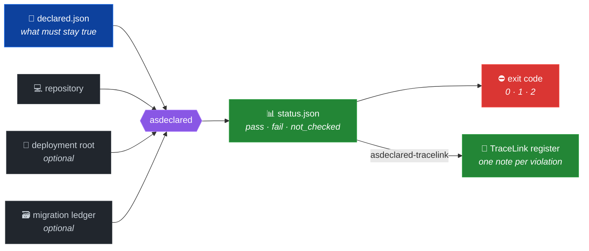

<h1 align="center">asdeclared</h1>

<p align="center">
  You declared how your system works — who writes each table, who owns
  each transaction, which bytes run in production.<br>
  <b>asdeclared tells you when reality stops matching the declaration.</b>
</p>

<p align="center">
  
</p>

<p align="center">
  <a href="LICENSE"></a>
  
  
  
  
</p>

<p align="center">
  <sub>Companion to <a href="https://github.com/emmepi86/TraceLink">TraceLink</a>,
  by the same author.<br>
  By <b>Massimiliano Paragnani</b> — <a href="https://aosol.cloud">aosol.cloud</a></sub>
</p>

---

## The problem

Architecture rarely breaks loudly. It drifts:

- the **deployed bytes** are not the bytes you reviewed — a stale copy
  *exists*, so presence checks stay green while production runs old code;
- a module everyone treats as *caller-transactional* quietly does its own
  `commit()`, so every "rollback-only" test above it attests a guarantee
  the code never gave;
- the **retry path** — exercised precisely when the primary just failed —
  still calls the entrypoint the primary was migrated away from;
- a table with a declared owner gains a **second, undeclared writer**,
  added in good faith by someone who never found the first;
- a **migration** is applied but never recorded, or edited *after* being
  applied, so the repository no longer describes the schema that actually
  ran.

Each of these is invisible to unit tests, linters and code review,
because each lives in the gap *between* things that are individually
correct. They are found the expensive way — in production, at the worst
time — unless something checks the declaration against reality on every
run.

## What it does



One CLI, five checks, all read-only:

| check | catches |
|---|---|
| `critical_deployed_bytes` | repo vs deployment SHA-256 mismatch on files you declare critical |
| `forbidden_transaction_ownership` | `commit()` / `rollback()` / connection acquisition (AST, never regex) inside modules declared caller-transactional |
| `authoritative_entrypoint_parity` | primary and retry symbols that do not converge on the declared authoritative callee |
| `competing_writer_discovery` | `INSERT/UPDATE/DELETE` on declared surfaces from files outside the declared writer list — every match with file and line |
| `migration_inventory_parity` | migrations in repo but not in the ledger, in the ledger but not in repo, or **edited after application** (digest mismatch) |

## Try it

```console
$ asdeclared --repo . --config declared.json --out status.json \
    --deployment-root /srv/deploy/current \
    --migration-ledger-json ledger.json
pass=7  fail=2  not_checked=0  blocking=2
report written to status.json
```

Exit codes: `0` clean · `1` config or input error · `2` violations.

Every finding in `status.json` carries the exact file and line, the
digests of every input, and the repo commit — so a red run is an
argument, not an opinion.

## Design rules

- **The engine knows nothing about your project.** Every symbol, table,
  path and convention lives in JSON config; each entry carries a stable
  id and a human rationale. The engine is reusable as-is on any repo.
- **Not having looked ≠ having verified.** Omitted optional inputs yield
  `not_checked`, never `pass`.
- **AST, never regex, for Python.** A comment mentioning `commit()` does
  not trigger. Unparsable files are *reported*, not skipped — a file
  that cannot be read must not count as clean.
- **Deterministic.** Two identical runs are byte-identical; no wall
  clock enters the output unless you pass `--collected-at`.
- **Writer discovery is a review queue, not an alarm.** Undeclared
  writers always show as `fail`, but gate the exit code only under
  `--strict` — a candidate deserves review, not automatic breakage.
- **Read-only by construction.** The only write is `--out`.

## Configuration

```json
{
  "critical_files": [
    {"id": "cf-worker", "path": "services/worker.py",
     "rationale": "stale copy once ran 40 minutes in production"}
  ],
  "caller_transactional_modules": [
    {"id": "tx-writer", "path": "services/writer.py",
     "forbidden_connection_calls": ["psycopg2.connect", "_get_connection"],
     "rationale": "receives the caller's transaction; must never own it"}
  ],
  "paired_entrypoints": [
    {"id": "ep-ingest", "caller_module": "services/ingest.py",
     "primary_symbol": "run", "retry_symbol": "retry",
     "authoritative_callee": "parse_v2",
     "rationale": "the retry once stayed on parse_v1 for months"}
  ],
  "authoritative_writers": [
    {"id": "aw-orders", "table": "orders",
     "declared_writers": ["services/order_writer.py"],
     "rationale": "single-writer surface since the double-writer incident"}
  ],
  "migration_directory": "migrations",
  "migration_filename_pattern": "^\\d{3}_.*\\.sql$",
  "migration_ledger_fields": {"filename": "filename", "digest": "sha256"}
}
```

The `rationale` fields are not decoration: six months from now they are
the only record of *why* a surface is guarded. Write them like you will
have forgotten everything — because you will have.

## TraceLink integration

Every asdeclared violation is born anchored — file and line. The bundled
adapter emits failing rules as an append-ready fragment for a
[TraceLink](https://github.com/emmepi86/TraceLink) findings register:

```console
$ asdeclared-tracelink --status status.json --prefix ARCH >> FINDINGS.md
```

Finding ids are stable across runs — derived from your config ids, not
from a counter — so a violation that persists maps to the same TraceLink
note and its history accumulates in follow-ups instead of duplicates.
The adapter never appends on its own: it emits, you decide.

Together the two tools close a loop neither closes alone: asdeclared
finds the drift, TraceLink remembers it at the exact line — both
directions — and flags it again the next time anyone touches that code.

## Provenance

Extracted from an internal incident-response tool whose five checks are
the five failure classes that actually happened — each found first by
losing time to it, then encoded so it cannot happen silently again. On
its first full run against the system it was built for, it found one
undeclared runtime writer and five migrations whose digests no longer
matched their ledger entries.

Tools built from postmortems know where to look.

## Licence

[Apache-2.0](LICENSE) © Massimiliano Paragnani
